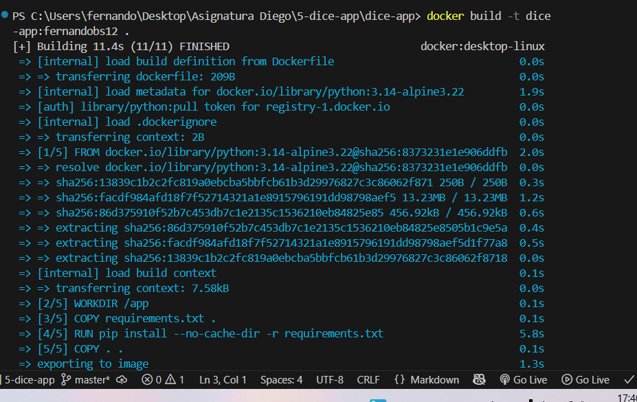
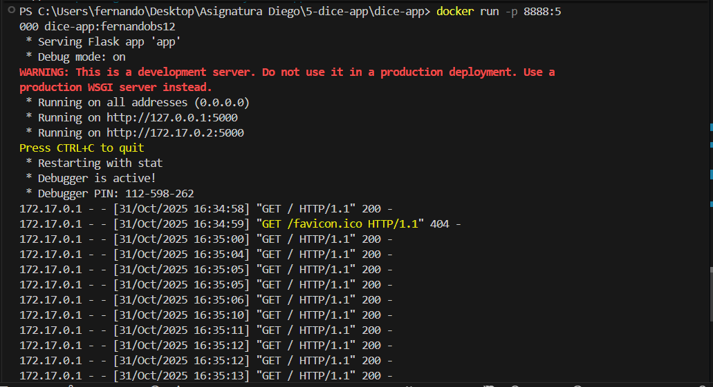
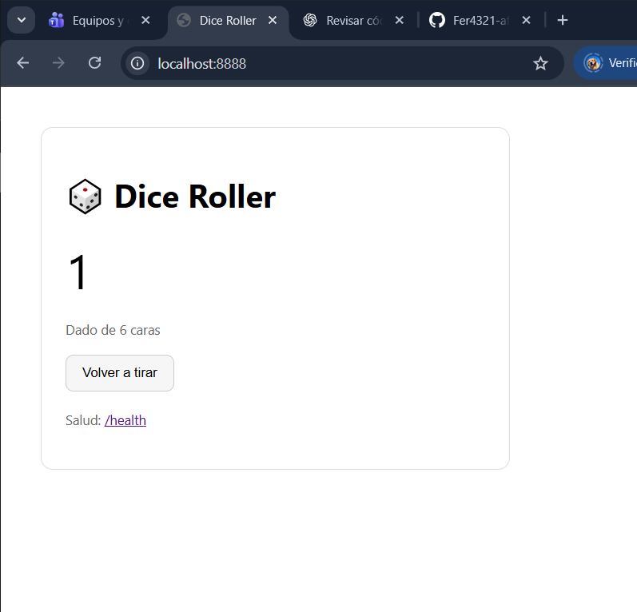
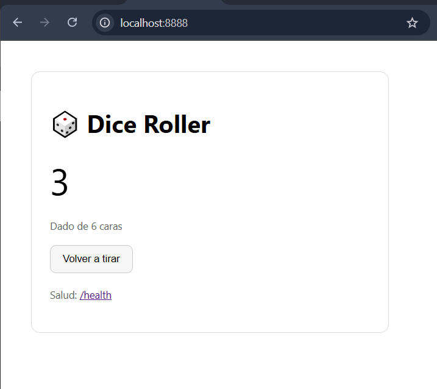
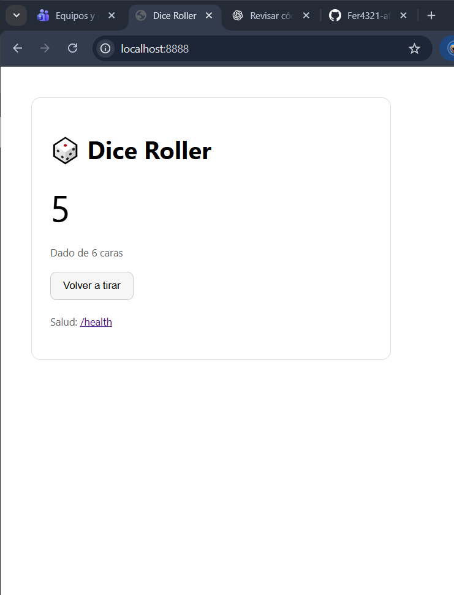

EJERCICIO DEL DADO:
COMANDO BUILD:

COMANDO RUN:

EXPLICACION DE DICE_SIDES:
Estamos pasando una variable de entorno al contenedor que indica cuántas caras tiene el dado. Si no se pasa, el dado usa 6 caras por defecto. Esto permite cambiar la dificultad o el rango de la tirada sin modificar el código.

RESULTADO: (imagenes porque video no me deja )

